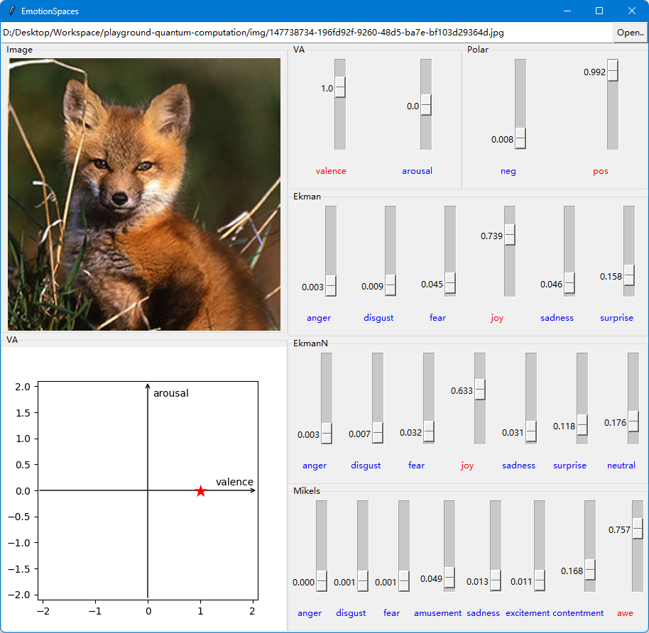

# EmotionSpaces

    How consistent are the various visual emotion dataset annotations, and the theoritical emotion spaces?

----

### Experiments

ℹ Download our pretrained weights [here](https://pan.quark.cn/s/85d8d3a983b8), unzip under `lightning_logs` folder :)

#### interactive space transform

- `python vis_gui.py -L "lightning_logs\MTN-r50-mlp\checkpoints\epoch=9-step=2000.ckpt"`



#### task accuracy

ℹ These stats are gathered from tensorboard records during training :(

⚪ baseline

| Accuracy (train/valid) | ResNet50 | ResNet101 | MobileNet_V2 | ViT_B_16 | ViT_B_32 |
| :-: | :-: | :-: | :-: | :-: | :-: |
| TwitterI | 98.71%/83.00%  | 98.74%/82.76% | 97.6%/80.16%  | 98.58%/82.55%  | 99.16%/79.06%  |
| EmoSet   | 89.79%/76.74%  | 82.18%/77.42% | 76.10%/74.93% | 92.06%/78.20%  | 83.55%/74.64%  |
| Artphoto | 97.83%/38.89%  | 98.68%/35.77% | 96.13%/29.65% | 99.34%/38.26%  | 97.52%/28.55%  |
| Abstract | 98.74%/18.40%  | 99.57%/14.57% | 92.46%/18.71% | 98.78%/15.00%  | 99.73%/19.04%  |
| Emo6Dim7 | 97.00%/39.00%  | 98.56%/42.24% | 89.75%/45.56% | 99.61%43.80%   | 98.04%/40.42%  |
| Emo6Dim6 | 97.95%/45.72%  | 97.21%/45.54% | 92.05%/47.17% | 98.26%/49.93%  | 98.26%/44.80%  |
| Emo6VA   | 0.188/1.135    | 0.17/1.12     | 0.2081/0.7786 | 0.03781/0.6638 | 0.04957/0.7252 |
| OASIS    | 0.07928/0.4739 | 0.5141/0.4202 | 0.179/0.5316  | 0.02315/0.4182 | 0.07642/0.6762 |

⚪ ours (MTN)

- Head = `linear`

| Head | Dataset | M-ResNet50 | M-MobileNet_V2 |
| :-:  | :-: | :-: | :-: |
| Polar  | TwitterI | 90.26%/83.62% | 86.62%/77.24% |
| Mikels | EmoSet   | 75.16%/67.01% | 72.76%/70.80% |
| EkmanN | Emo6Dim7 | 50.79%/41.91% | 46.50%/41.68% |
| Ekman  | Emo6Dim6 | 54.72%/48.36% | 50.31%/46.64% |
| VA     | Emo6VA   | 0.5276/0.6186 | 0.5401/0.6707 |

- Head = `mlp`

| Head | Dataset | M-ResNet50 | M-MobileNet_V2 | M-ViT_B_16 |
| :-: | :-: | :-: | :-: | :-: |
| Polar  | TwitterI | 92.45%/84.70% | 86.10%/80.94% | 91.68%/81.93% |
| Mikels | EmoSet   | 75.39%/72.46% | 76.58%/70.63% | 76.39%/68.86% |
| EkmanN | Emo6Dim7 | 52.33%/43.35% | 44.49%/42.02% | 52.72%/41.15% |
| Ekman  | Emo6Dim6 | 57.13%/45.96% | 48.88%/47.44% | 55.59%/43.14% |
| VA     | Emo6VA   | 0.4911/0.6186 | 0.5664/0.6691 | 0.4923/0.6303 |


### Datasets

| dataset | n_samples | annotations | comment |
| :-: | :-: | :-: | :-: |
|   [Abstract](https://www.imageemotion.org/testImages_abstract.zip)                      | 280/228 | Mikels 8-dim prob/clf         | prob =(argmax w/o tie)=> clf |
|   [ArtPhoto](https://www.imageemotion.org/testImages_artphoto.zip)                      | 806     | Mikels 8-dim clf              |  |
|   [Emotion6](http://chenlab.ece.cornell.edu/people/kuanchuan/publications/Emotion6.zip) | 1980    | Ekman+neutral 7-dim prob + VA |  |
|      [GAPED](https://www.unige.ch/cisa/index.php/download_file/view/288/296/)           | 730     | VA                            | 6 specific object domains, same-sized |
|  [Twitter I](https://1drv.ms/u/s!AqDZbp_iImWrhqI8k_S2uLqab_urdg?e=zwbdPG)               | 1269    | 2-dim prob                    |  |
|         [FI](https://1drv.ms/u/s!AqDZbp_iImWrhppifntgxRuw_6o2Ww?e=u2Tv7I)               | 23185   | Mikels 8-dim clf              | contain invalid samples (banned pictures) |
| [EmoSet-118K](https://www.dropbox.com/scl/fi/myue506itjfc06m7svdw6/EmoSet-118K.zip?rlkey=7f3oyjkr6zyndf0gau7t140rv&dl=0) | 118k | Mikels 8-dim + bright/colorful clf |  |
| [LUCFER](https://cil.cs.ucf.edu/dataset-2/labeled-ucf-emotion-recognition/) | 883k |  | web links |
| [OASIS](https://www.dropbox.com/sh/4qaoqs77c9e5muh/AABBw07ozE__2Y0LVQHVL-8ca?dl=1) | 900 | VA | the gender matters |
| [FER-2013](https://www.kaggle.com/datasets/deadskull7/fer2013) | 35887 | Ekman+neutral 7dim clf |
| [Emotic](https://github.com/Tandon-A/emotic) | ? | 26-dim clf + VAD | **person bbox** |

Categorical Emotion States ([ref](https://zhuanlan.zhihu.com/p/617187076)):

```
Ekman 6-dim: anger, disgust, fear, joy, sadness, surprise
=> https://www.paulekman.com/universal-emotions/

Mikels 8-dim: amusement, anger, awe, contentment, disgust, excitement, fear, sadness

Plutchik Wheel of Emotions: 
=> https://positivepsychology.com/emotion-wheel
=> https://www.jstor.org/stable/27857503?seq=1
```


### References

- surveys & essays
  - 情感计算与理解研究发展概述: [https://zhuanlan.zhihu.com/p/537984722](https://zhuanlan.zhihu.com/p/537984722)
  - Emotion Recognition from Multiple Modalities: [https://zhuanlan.zhihu.com/p/617187076](https://zhuanlan.zhihu.com/p/617187076)
  - Label Distribution Learning: [https://arxiv.org/abs/1408.6027](https://arxiv.org/abs/1408.6027)
- dataset
  - Image-Emotion-Datasets: [https://github.com/haoyev5/Image-Emotion-Datasets](https://github.com/haoyev5/Image-Emotion-Datasets)
  - Abstract & ArtPhoto: [https://www.imageemotion.org/](https://www.imageemotion.org/)
  - Emotion6: [http://chenlab.ece.cornell.edu/downloads.html](http://chenlab.ece.cornell.edu/downloads.html)
  - GAPED (see `The Geneva Affective PicturE Database (GAPED)`): [https://www.unige.ch/cisa/research/materials-and-online-research/research-material/](https://www.unige.ch/cisa/research/materials-and-online-research/research-material/)
  - Twitter I (see `Sentiment Analysis - PCNN Twitter Dataset`): [https://qzyou.github.io/](https://qzyou.github.io/)
  - FI (see `Emotion Analysis - Emotion Dataset`): [https://qzyou.github.io/](https://qzyou.github.io/)
  - UnBiasedEmo & Emotion-6: [https://rpand002.github.io/emotion.html](https://rpand002.github.io/emotion.html)
  - EmoSet: [https://github.com/JingyuanYY/EmoSet](https://github.com/JingyuanYY/EmoSet)
  - LUCFER: [https://cil.cs.ucf.edu/dataset-2/labeled-ucf-emotion-recognition/](https://cil.cs.ucf.edu/dataset-2/labeled-ucf-emotion-recognition/)
  - OASIS: [https://www.dropbox.com/sh/4qaoqs77c9e5muh/AABBw07ozE__2Y0LVQHVL-8ca?dl=0](https://www.dropbox.com/sh/4qaoqs77c9e5muh/AABBw07ozE__2Y0LVQHVL-8ca?dl=0)
  - FER-2013: [https://www.kaggle.com/datasets/deadskull7/fer2013](https://www.kaggle.com/datasets/deadskull7/fer2013)
  - Emotic: [https://github.com/Tandon-A/emotic](https://github.com/Tandon-A/emotic)

----
by Armit
2023/12/11 
2024/04/20 
